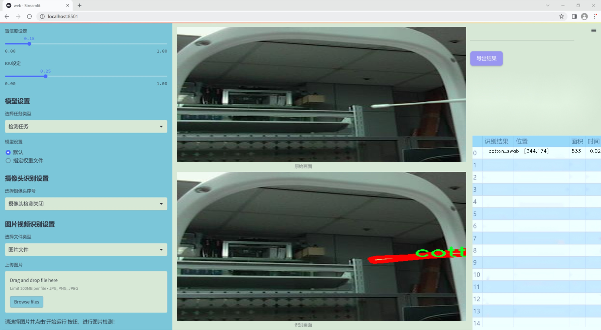
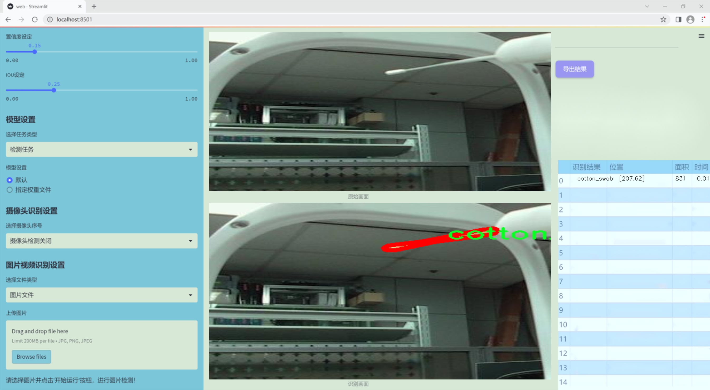
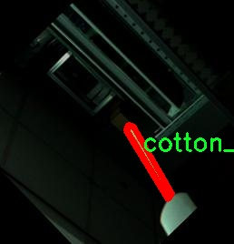
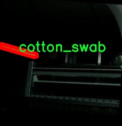
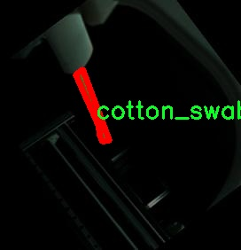
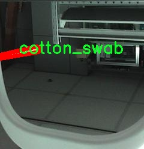
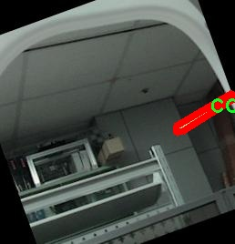

### 1.背景意义

研究背景与意义

随着医疗卫生领域对样本采集精度和效率的不断提升，棉签作为一种常见的采样工具，其检测和识别技术逐渐受到重视。棉签在临床诊断、实验室检测及日常护理中扮演着重要角色，因此，开发一个高效的棉签检测系统显得尤为必要。传统的棉签检测方法多依赖人工识别，存在着效率低、误差大等问题，难以满足现代医疗的需求。基于此，采用计算机视觉技术进行棉签的自动检测与识别，将极大地提高样本处理的效率和准确性。

本研究旨在基于改进的YOLOv11模型，构建一个高效的棉签检测系统。YOLO（You Only Look Once）系列模型因其高效的实时检测能力而广泛应用于物体识别领域。通过对YOLOv11模型的改进，结合特定的棉签数据集，能够实现对棉签的精准定位与分类。该数据集包含1900张经过精细标注的棉签图像，涵盖了丰富的样本变异性，为模型的训练提供了坚实的基础。

在数据预处理和增强方面，本研究采用了一系列先进的技术手段，包括图像翻转、旋转、裁剪和亮度调整等。这些技术不仅丰富了训练数据集，还有效提高了模型的鲁棒性，使其能够在不同环境和条件下保持良好的检测性能。通过这些创新性的研究和技术应用，期望能够为棉签的自动检测提供一种新的解决方案，推动医疗检测技术的进步。

综上所述，基于改进YOLOv11的棉签检测系统不仅具有重要的学术价值，还将为实际应用提供有效的技术支持，促进医疗卫生领域的智能化发展。

### 2.视频效果

[2.1 视频效果](https://www.bilibili.com/video/BV1cYkQYhEBP/)

### 3.图片效果






##### [项目涉及的源码数据来源链接](https://kdocs.cn/l/cszuIiCKVNis)**

注意：本项目提供训练的数据集和训练教程,由于版本持续更新,暂不提供权重文件（best.pt）,请按照6.训练教程进行训练后实现上图演示的效果。

### 4.数据集信息

##### 4.1 本项目数据集类别数＆类别名

nc: 1
names: ['cotton_swab']


该项目为【图像分割】数据集，请在【训练教程和Web端加载模型教程（第三步）】这一步的时候按照【图像分割】部分的教程来训练

##### 4.2 本项目数据集信息介绍

本项目数据集信息介绍

本项目旨在改进YOLOv11模型在棉签检测系统中的应用，数据集的核心主题围绕“swab sampling”展开。为了实现高效且准确的棉签检测，我们构建了一个专门的数据集，包含了与棉签采样相关的多样化图像。该数据集的类别数量为1，具体类别为“cotton_swab”，这意味着所有的图像均聚焦于棉签这一单一对象。这种专一性不仅有助于模型的精准训练，也能提高其在实际应用中的识别效率。

在数据集的构建过程中，我们注重了图像的多样性和代表性，确保所收集的样本涵盖了不同环境、光照条件和背景下的棉签图像。这种多样性使得模型能够更好地适应现实世界中的变化，提高其鲁棒性。此外，数据集中的图像经过精心标注，确保每个棉签对象都被准确框定，为YOLOv11的训练提供了高质量的监督信号。

通过对这一数据集的训练，模型将能够学习到棉签的特征，包括其形状、颜色和在不同场景中的表现。这样的训练过程不仅限于静态图像，还可以扩展到视频流的实时检测，进一步提升棉签在医疗、实验室等领域的应用价值。总之，本项目的数据集为改进YOLOv11的棉签检测系统奠定了坚实的基础，期望通过高效的训练和优化，最终实现更高精度的棉签识别与检测。











### 5.全套项目环境部署视频教程（零基础手把手教学）

[5.1 所需软件PyCharm和Anaconda安装教程（第一步）](https://www.bilibili.com/video/BV1BoC1YCEKi/?spm_id_from=333.999.0.0&vd_source=bc9aec86d164b67a7004b996143742dc)


[5.2 安装Python虚拟环境创建和依赖库安装视频教程（第二步）](https://www.bilibili.com/video/BV1ZoC1YCEBw?spm_id_from=333.788.videopod.sections&vd_source=bc9aec86d164b67a7004b996143742dc)

### 6.改进YOLOv11训练教程和Web_UI前端加载模型教程（零基础手把手教学）

[6.1 改进YOLOv11训练教程和Web_UI前端加载模型教程（第三步）](https://www.bilibili.com/video/BV1BoC1YCEhR?spm_id_from=333.788.videopod.sections&vd_source=bc9aec86d164b67a7004b996143742dc)


按照上面的训练视频教程链接加载项目提供的数据集，运行train.py即可开始训练



     Epoch   gpu_mem       box       obj       cls    labels  img_size
     1/200     20.8G   0.01576   0.01955  0.007536        22      1280: 100%|██████████| 849/849 [14:42<00:00,  1.04s/it]
               Class     Images     Labels          P          R     mAP@.5 mAP@.5:.95: 100%|██████████| 213/213 [01:14<00:00,  2.87it/s]
                 all       3395      17314      0.994      0.957      0.0957      0.0843

     Epoch   gpu_mem       box       obj       cls    labels  img_size
     2/200     20.8G   0.01578   0.01923  0.007006        22      1280: 100%|██████████| 849/849 [14:44<00:00,  1.04s/it]
               Class     Images     Labels          P          R     mAP@.5 mAP@.5:.95: 100%|██████████| 213/213 [01:12<00:00,  2.95it/s]
                 all       3395      17314      0.996      0.956      0.0957      0.0845

     Epoch   gpu_mem       box       obj       cls    labels  img_size
     3/200     20.8G   0.01561    0.0191  0.006895        27      1280: 100%|██████████| 849/849 [10:56<00:00,  1.29it/s]
               Class     Images     Labels          P          R     mAP@.5 mAP@.5:.95: 100%|███████   | 187/213 [00:52<00:00,  4.04it/s]
                 all       3395      17314      0.996      0.957      0.0957      0.0845


###### [项目数据集下载链接](https://kdocs.cn/l/cszuIiCKVNis)

### 7.原始YOLOv11算法讲解

YOLOv11是Ultralytics推出的YOLO系列最新版本，专为实现尖端的物体检测而设计。其架构和训练方法上进行了重大改进，使之不仅具备卓越的准确性和处理速度，还在计算效率上实现了一场革命。得益于其改进的主干和颈部架构，YOLOv11在特征提取和处理复杂任务时表现更加出色。在2024年9月27日，Ultralytics通过长达九小时的在线直播发布这一新作，展示了其在计算机视觉领域的革新。

YOLOv11通过精细的架构设计和优化训练流程，在保持高精度的同时，缩减了参数量，与YOLOv8m相比减少了22%的参数，使其在COCO数据集上的平均准确度（mAP）有所提升。这种效率的提高使YOLOv11非常适合部署在各种硬件环境中，包括边缘设备、云计算平台以及支持NVIDIA GPU的系统，确保在灵活性上的优势。

该模型支持广泛的任务，从对象检测、实例分割到图像分类、姿态估计和定向对象检测（OBB），几乎覆盖了计算机视觉的所有主要挑战。其创新的C3k2和C2PSA模块提升了网络深度和注意力机制的应用，提高了特征提取的效率和效果。同时，YOLOv11的改进网络结构也使之在复杂视觉任务上得以从容应对，成为各类计算机视觉任务的多功能选择。这些特性令YOLOv11在实施实时物体检测的各个领域中表现出众。
* * *

2024年9月27日，Ultralytics在线直播长达九小时，为YOLO11召开“发布会”

YOLO11 是 Ultralytics YOLO 系列实时物体检测器的最新版本，它以尖端的准确性、速度和效率重新定义了可能性。在之前 YOLO
版本的显著进步的基础上，YOLO11 在架构和训练方法方面进行了重大改进，使其成为各种计算机视觉任务的多功能选择。


##### YOLO11主要特点：

  * 增强的特征提取：YOLO11 采用了改进的主干和颈部架构，增强了特征提取能力，可实现更精确的对象检测和复杂任务性能。
  * 针对效率和速度进行了优化：YOLO11 引入了完善的架构设计和优化的训练流程，可提供更快的处理速度，并在准确度和性能之间保持最佳平衡。
  * 更少的参数，更高的准确度：借助模型设计的进步，YOLO11m 在 COCO 数据集上实现了更高的平均准确度 (mAP)，同时使用的参数比 YOLOv8m 少 22%，从而提高了计算效率，同时又不影响准确度。
  * 跨环境的适应性：YOLO11 可以无缝部署在各种环境中，包括边缘设备、云平台和支持 NVIDIA GPU 的系统，从而确保最大的灵活性。
  * 支持的任务范围广泛：无论是对象检测、实例分割、图像分类、姿势估计还是定向对象检测 (OBB)，YOLO11 都旨在满足各种计算机视觉挑战。

##### 支持的任务和模式

YOLO11 以 YOLOv8 中引入的多功能模型系列为基础，为各种计算机视觉任务提供增强的支持：

Model| Filenames| Task| Inference| Validation| Training| Export  
---|---|---|---|---|---|---  
YOLO11| yolol11n.pt, yolol11s.pt, yolol11m.pt, yolol11x.pt| Detection| ✅| ✅|
✅| ✅  
YOLO11-seg| yolol11n-seg.pt, yolol11s-seg.pt, yolol11m-seg.pt,
yolol11x-seg.pt| Instance Segmentation| ✅| ✅| ✅| ✅  
YOLO11-pose| yolol11n-pose.pt, yolol11s-pose.pt, yolol11m-pose.pt,
yolol11x-pose.pt| Pose/Keypoints| ✅| ✅| ✅| ✅  
YOLO11-obb| yolol11n-obb.pt, yolol11s-obb.pt, yolol11m-obb.pt,
yolol11x-obb.pt| Oriented Detection| ✅| ✅| ✅| ✅  
YOLO11-cls| yolol11n-cls.pt, yolol11s-cls.pt, yolol11m-cls.pt,
yolol11x-cls.pt| Classification| ✅| ✅| ✅| ✅  
  
##### 简单的 YOLO11 训练和推理示例

以下示例适用于用于对象检测的 YOLO11 Detect 模型。

    
    
    from ultralytics import YOLO
    
    # Load a model
    model = YOLO("yolo11n.pt")
    
    # Train the model
    train_results = model.train(
        data="coco8.yaml",  # path to dataset YAML
        epochs=100,  # number of training epochs
        imgsz=640,  # training image size
        device="cpu",  # device to run on, i.e. device=0 or device=0,1,2,3 or device=cpu
    )
    
    # Evaluate model performance on the validation set
    metrics = model.val()
    
    # Perform object detection on an image
    results = model("path/to/image.jpg")
    results[0].show()
    
    # Export the model to ONNX format
    path = model.export(format="onnx")  # return path to exported model

##### 支持部署于边缘设备

YOLO11 专为适应各种环境而设计，包括边缘设备。其优化的架构和高效的处理能力使其适合部署在边缘设备、云平台和支持 NVIDIA GPU
的系统上。这种灵活性确保 YOLO11 可用于各种应用，从移动设备上的实时检测到云环境中的复杂分割任务。有关部署选项的更多详细信息，请参阅导出文档。

##### YOLOv11 yaml文件

    
    
    # Ultralytics YOLO 🚀, AGPL-3.0 license
    # YOLO11 object detection model with P3-P5 outputs. For Usage examples see https://docs.ultralytics.com/tasks/detect
    
    # Parameters
    nc: 80 # number of classes
    scales: # model compound scaling constants, i.e. 'model=yolo11n.yaml' will call yolo11.yaml with scale 'n'
      # [depth, width, max_channels]
      n: [0.50, 0.25, 1024] # summary: 319 layers, 2624080 parameters, 2624064 gradients, 6.6 GFLOPs
      s: [0.50, 0.50, 1024] # summary: 319 layers, 9458752 parameters, 9458736 gradients, 21.7 GFLOPs
      m: [0.50, 1.00, 512] # summary: 409 layers, 20114688 parameters, 20114672 gradients, 68.5 GFLOPs
      l: [1.00, 1.00, 512] # summary: 631 layers, 25372160 parameters, 25372144 gradients, 87.6 GFLOPs
      x: [1.00, 1.50, 512] # summary: 631 layers, 56966176 parameters, 56966160 gradients, 196.0 GFLOPs
    
    # YOLO11n backbone
    backbone:
      # [from, repeats, module, args]
      - [-1, 1, Conv, [64, 3, 2]] # 0-P1/2
      - [-1, 1, Conv, [128, 3, 2]] # 1-P2/4
      - [-1, 2, C3k2, [256, False, 0.25]]
      - [-1, 1, Conv, [256, 3, 2]] # 3-P3/8
      - [-1, 2, C3k2, [512, False, 0.25]]
      - [-1, 1, Conv, [512, 3, 2]] # 5-P4/16
      - [-1, 2, C3k2, [512, True]]
      - [-1, 1, Conv, [1024, 3, 2]] # 7-P5/32
      - [-1, 2, C3k2, [1024, True]]
      - [-1, 1, SPPF, [1024, 5]] # 9
      - [-1, 2, C2PSA, [1024]] # 10
    
    # YOLO11n head
    head:
      - [-1, 1, nn.Upsample, [None, 2, "nearest"]]
      - [[-1, 6], 1, Concat, [1]] # cat backbone P4
      - [-1, 2, C3k2, [512, False]] # 13
    
      - [-1, 1, nn.Upsample, [None, 2, "nearest"]]
      - [[-1, 4], 1, Concat, [1]] # cat backbone P3
      - [-1, 2, C3k2, [256, False]] # 16 (P3/8-small)
    
      - [-1, 1, Conv, [256, 3, 2]]
      - [[-1, 13], 1, Concat, [1]] # cat head P4
      - [-1, 2, C3k2, [512, False]] # 19 (P4/16-medium)
    
      - [-1, 1, Conv, [512, 3, 2]]
      - [[-1, 10], 1, Concat, [1]] # cat head P5
      - [-1, 2, C3k2, [1024, True]] # 22 (P5/32-large)
    
      - [[16, 19, 22], 1, Detect, [nc]] # Detect(P3, P4, P5)
    

**YOLO11和YOLOv8 yaml文件的区别**


##### 改进模块代码

  * C3k2 

    
    
    class C3k2(C2f):
        """Faster Implementation of CSP Bottleneck with 2 convolutions."""
    
        def __init__(self, c1, c2, n=1, c3k=False, e=0.5, g=1, shortcut=True):
            """Initializes the C3k2 module, a faster CSP Bottleneck with 2 convolutions and optional C3k blocks."""
            super().__init__(c1, c2, n, shortcut, g, e)
            self.m = nn.ModuleList(
                C3k(self.c, self.c, 2, shortcut, g) if c3k else Bottleneck(self.c, self.c, shortcut, g) for _ in range(n)
            )

C3k2，它是具有两个卷积的CSP（Partial Cross Stage）瓶颈架构的更快实现。

**类继承：**

  * `C3k2`继承自类`C2f`。这表明`C2f`很可能实现了经过修改的基本CSP结构，而`C3k2`进一步优化或修改了此结构。

**构造函数（`__init__`）：**

  * `c1`：输入通道。

  * `c2`：输出通道。

  * `n`：瓶颈层数（默认为1）。

  * `c3k`：一个布尔标志，确定是否使用`C3k`块或常规`Bottleneck`块。

  * `e`：扩展比率，控制隐藏层的宽度（默认为0.5）。

  * `g`：分组卷积的组归一化参数或组数（默认值为 1）。

  * `shortcut`：一个布尔值，用于确定是否在网络中包含快捷方式连接（默认值为 `True`）。

**初始化：**

  * `super().__init__(c1, c2, n, short-cut, g, e)` 调用父类 `C2f` 的构造函数，初始化标准 CSP 组件，如通道数、快捷方式、组等。

**模块列表（`self.m`）：**

  * `nn.ModuleList` 存储 `C3k` 或 `Bottleneck` 模块，具体取决于 `c3k` 的值。

  * 如果 `c3k` 为 `True`，它会初始化 `C3k` 模块。`C3k` 模块接收以下参数：

  * `self.c`：通道数（源自 `C2f`）。

  * `2`：这表示在 `C3k` 块内使用了两个卷积层。

  * `shortcut` 和 `g`：从 `C3k2` 构造函数传递。

  * 如果 `c3k` 为 `False`，则初始化标准 `Bottleneck` 模块。

`for _ in range(n)` 表示将创建 `n` 个这样的块。

**总结：**

  * `C3k2` 实现了 CSP 瓶颈架构，可以选择使用自定义 `C3k` 块（具有两个卷积）或标准 `Bottleneck` 块，具体取决于 `c3k` 标志。

  * C2PSA

    
    
    class C2PSA(nn.Module):
        """
        C2PSA module with attention mechanism for enhanced feature extraction and processing.
    
        This module implements a convolutional block with attention mechanisms to enhance feature extraction and processing
        capabilities. It includes a series of PSABlock modules for self-attention and feed-forward operations.
    
        Attributes:
            c (int): Number of hidden channels.
            cv1 (Conv): 1x1 convolution layer to reduce the number of input channels to 2*c.
            cv2 (Conv): 1x1 convolution layer to reduce the number of output channels to c.
            m (nn.Sequential): Sequential container of PSABlock modules for attention and feed-forward operations.
    
        Methods:
            forward: Performs a forward pass through the C2PSA module, applying attention and feed-forward operations.
    
        Notes:
            This module essentially is the same as PSA module, but refactored to allow stacking more PSABlock modules.
    
        Examples:
            >>> c2psa = C2PSA(c1=256, c2=256, n=3, e=0.5)
            >>> input_tensor = torch.randn(1, 256, 64, 64)
            >>> output_tensor = c2psa(input_tensor)
        """
    
        def __init__(self, c1, c2, n=1, e=0.5):
            """Initializes the C2PSA module with specified input/output channels, number of layers, and expansion ratio."""
            super().__init__()
            assert c1 == c2
            self.c = int(c1 * e)
            self.cv1 = Conv(c1, 2 * self.c, 1, 1)
            self.cv2 = Conv(2 * self.c, c1, 1)
    
            self.m = nn.Sequential(*(PSABlock(self.c, attn_ratio=0.5, num_heads=self.c // 64) for _ in range(n)))
    
        def forward(self, x):
            """Processes the input tensor 'x' through a series of PSA blocks and returns the transformed tensor."""
            a, b = self.cv1(x).split((self.c, self.c), dim=1)
            b = self.m(b)
            return self.cv2(torch.cat((a, b), 1))

`C2PSA` 模块是一个自定义神经网络层，带有注意力机制，用于增强特征提取和处理。

**类概述**

  * **目的：**

  * `C2PSA` 模块引入了一个卷积块，利用注意力机制来改进特征提取和处理。

  * 它使用一系列 `PSABlock` 模块，这些模块可能代表某种形式的位置自注意力 (PSA)，并且该架构旨在允许堆叠多个 `PSABlock` 层。

**构造函数（`__init__`）：**

  * **参数：**

  * `c1`：输入通道（必须等于 `c2`）。

  * `c2`：输出通道（必须等于 `c1`）。

  * `n`：要堆叠的 `PSABlock` 模块数量（默认值为 1）。

  * `e`：扩展比率，用于计算隐藏通道的数量（默认值为 0.5）。

  * **属性：**

  * `self.c`：隐藏通道数，计算为 `int(c1 * e)`。

  * `self.cv1`：一个 `1x1` 卷积，将输入通道数从 `c1` 减少到 `2 * self.c`。这为将输入分成两部分做好准备。

  * `self.cv2`：另一个 `1x1` 卷积，处理后将通道维度恢复回 `c1`。

  * `self.m`：一系列 `PSABlock` 模块。每个 `PSABlock` 接收 `self.c` 通道，注意头的数量为 `self.c // 64`。每个块应用注意和前馈操作。

**前向方法：**

  * **输入：**

  * `x`，输入张量。

  * **操作：**

  1. `self.cv1(x)` 应用 `1x1` 卷积，将输入通道大小从 `c1` 减小到 `2 * self.c`。

  2. 生成的张量沿通道维度分为两部分，`a` 和 `b`。

  * `a`：第一个 `self.c` 通道。

  * `b`：剩余的 `self.c` 通道。

  1. `b` 通过顺序容器 `self.m`，它是 `PSABlock` 模块的堆栈。这部分经过基于注意的处理。

  2. 处理后的张量 `b` 与 `a` 连接。

  3. `self.cv2` 应用 `1x1` 卷积，将通道大小恢复为 `c1`。

  * **输出：**

  * 应用注意和卷积操作后的变换后的张量。

**总结：**

  * **C2PSA** 是一个增强型卷积模块，它通过堆叠的 `PSABlock` 模块应用位置自注意力。它拆分输入张量，将注意力应用于其中一部分，然后重新组合并通过最终卷积对其进行处理。此结构有助于从输入数据中提取复杂特征。

##### 网络结构


### 8.200+种全套改进YOLOV11创新点原理讲解

#### 8.1 200+种全套改进YOLOV11创新点原理讲解大全

由于篇幅限制，每个创新点的具体原理讲解就不全部展开，具体见下列网址中的改进模块对应项目的技术原理博客网址【Blog】（创新点均为模块化搭建，原理适配YOLOv5~YOLOv11等各种版本）

[改进模块技术原理博客【Blog】网址链接](https://gitee.com/qunmasj/good)


#### 8.2 精选部分改进YOLOV11创新点原理讲解

###### 这里节选部分改进创新点展开原理讲解(完整的改进原理见上图和[改进模块技术原理博客链接](https://gitee.com/qunmasj/good)【如果此小节的图加载失败可以通过CSDN或者Github搜索该博客的标题访问原始博客，原始博客图片显示正常】


### OREPA：在线卷积重参数化
卷积神经网络(CNNs)已经在许多计算机视觉任务的应用成功，包括图像分类、目标检测、语义分割等。精度和模型效率之间的权衡也已被广泛讨论。

一般来说，一个精度较高的模型通常需要一个更复杂的块，一个更宽或更深的结构。然而，这样的模型总是太重，无法部署，特别是在硬件性能有限、需要实时推理的场景下。考虑到效率，更小、更紧凑和更快的模型自然是首选。

为了获得一个部署友好且高精度的模型，有研究者提出了基于结构重参数化的方法来释放性能。在这些方法中，模型在训练阶段和推理阶段有不同的结构。具体来说，使用复杂的训练阶段拓扑，即重参数化的块，来提高性能。训练结束后，通过等效变换将一个复杂的块重参为成一个单一的线性层。重参后的模型通常具有一个整洁架构模型，例如，通常是一个类似VGG的或一个类似ResNet的结构。从这个角度来看，重参化策略可以在不引入额外的推理时间成本的情况下提高模型的性能。


BN层是重构模型的关键组成部分。在一个重新解析块(图1(b))中，在每个卷积层之后立即添加一个BN层。可以观察到，去除这些BN层会导致的性能退化。然而，当考虑到效率时，这种BN层的使用出乎意料地在训练阶段带来了巨大的计算开销。在推理阶段，复杂的块可以被压缩成一个卷积层。但是，在训练过程中，BN层是非线性的，也就是说，它们将特征映射除以它的标准差，这就阻止了合并整个块。因此，存在大量的中间计算操作(large FLOPS)和缓冲特征映射(high memory usage)。更糟糕的是，这么高的训练预算使得很难探索更复杂和可能更强的重参块。很自然地，下面的问题就出现了：

为什么标准化在重参中这么重要？

通过分析和实验，作者认为BN层中的尺度因子最重要，因为它们能够使不同分支的优化方向多样化。

基于观察结果，作者提出了在线重参化(OREPA)(图1(c))，这是一个两阶段的pipeline，使之能够简化复杂的training-time re-param block。

在第一阶段，block linearization，去除所有的非线性BN层，并引入线性缩放层。这些层与BN层具有相似的性质，因此它们使不同分支的优化多样化。此外，这些层都是线性的，可以在训练过程中合并成卷积层。

第二阶段，block squeezing，将复杂的线性块简化为单一的卷积层。OREPA通过减少由中间计算层引起的计算和存储开销，显著降低了训练成本，对性能只有非常小的影响。

此外，高效化使得探索更复杂的重参化拓扑成为可能。为了验证这一点，作者进一步提出了几个重参化的组件，以获得更好的性能。

在ImageNet分类任务上评估了所提出的OREPA。与最先进的修复模型相比，OREPA将额外的训练时间GPU内存成本降低了65%到75%，并将训练过程加快了1.5-2.3倍。同时，OREPA-ResNet和OREPA-VGG的性能始终优于+0.2%∼+0.6%之前的DBB和RepVGG方法。同时作者还评估了在下游任务上的OREPA，即目标检测和语义分割。作者发现OREPA可以在这些任务上也可以带来性能的提高。

提出了在线卷积重参化(OREPA)策略，这极大地提高了重参化模型的训练效率，并使探索更强的重参化块成为可能；

通过对重参化模型工作机制的分析，用引入的线性尺度层代替BN层，这仍然提供了不同的优化方向，并保持了表示能力;

在各种视觉任务上的实验表明，OREPA在准确性和训练效率方面都优于以前的重参化模型(DBB/RepVGG)。


#### 结构重参化
结构重参化最近被重视并应用于许多计算机视觉任务，如紧凑模型设计、架构搜索和剪枝。重参化意味着不同的架构可以通过参数的等价转换来相互转换。例如，1×1卷积的一个分支和3×3卷积的一个分支，可以转移到3×3卷积的单个分支中。在训练阶段，设计了多分支和多层拓扑来取代普通的线性层(如conv或全连接层)来增强模型。Cao等讨论了如何在训练过程中合并深度可分离卷积核。然后在推理过程中，将训练时间的复杂模型转移到简单模型中，以便于更快的推理。

在受益于复杂的training-time拓扑，同时，当前的重参化方法训练使用不可忽略的额外计算成本。当块变得更复杂以变得更强的表示时，GPU内存利用率和训练时间将会越来越长，最终走向不可接受。与以往的重参化方法不同，本文更多地关注训练成本。提出了一种通用的在线卷积重参化策略，使training-time的结构重参化成为可能。


#### Normalization
BN被提出来缓解训练非常深度神经网络时的梯度消失问题。人们认为BN层是非常重要的，因为它们平滑了损失。最近关于无BN神经网络的研究声称，BN层并不是不可或缺的。通过良好的初始化和适当的正则化，可以优雅地去除BN层。

对于重参化模型，作者认为重参化块中的BN层是关键的。无BN的变体将会出现性能下降。然而，BN层是非线性的，也就是说，它们将特征图除以它的标准差，这阻止了在线合并块。为了使在线重参化可行，作者去掉了重参块中的所有BN层，并引入了BN层的线性替代方法，即线性缩放层。

#### 卷积分解
标准卷积层计算比较密集，导致大的FLOPs和参数量。因此，卷积分解方法被提出，并广泛应用于移动设备的轻量化模型中。重参化方法也可以看作是卷积分解的某种形式，但它更倾向于更复杂的拓扑结构。本文的方法的不同之处在于，在kernel-level上分解卷积，而不是在structure level。

#### 在线重参化
在本节中，首先，分析了关键组件，即重参化模型中的BN层，在此基础上提出了在线重参化(OREPA)，旨在大大减少再参数化模型的训练时间预算。OREPA能够将复杂的训练时间块简化为一个卷积层，并保持了较高的精度。

OREPA的整体pipeline如图所示，它包括一个Block Linearization阶段和一个Block Squeezing阶段。


参考该博客通过分析多层和多分支结构的优化多样性，深入研究了重参化的有效性，并证明了所提出的线性缩放层和BN层具有相似的效果。

最后，随着训练预算的减少，进一步探索了更多的组件，以实现更强的重参化模型，成本略有增加。

#### 重参化中的Normalization
作者认为中间BN层是重参化过程中多层和多分支结构的关键组成部分。以SoTA模型DBB和RepVGG为例，去除这些层会导致严重的性能下降，如表1所示。


这种观察结果也得到了Ding等人的实验支持。因此，作者认为中间的BN层对于重参化模型的性能是必不可少的。

然而，中间BN层的使用带来了更高的训练预算。作者注意到，在推理阶段，重参化块中的所有中间操作都是线性的，因此可以合并成一个卷积层，从而形成一个简单的结构。

但在训练过程中，BN层是非线性的，即它们将特征映射除以其标准差。因此，中间操作应该单独计算，这将导致更高的计算和内存成本。更糟糕的是，如此高的成本将阻止探索更强大的训练模块。

#### Block Linearization
如3.1中所述，中间的BN层阻止了在训练过程中合并单独的层。然而，由于性能问题，直接删除它们并不简单。为了解决这一困境，作者引入了channel级线性尺度操作作为BN的线性替代方法。

缩放层包含一个可学习的向量，它在通道维度中缩放特征映射。线性缩放层具有与BN层相似的效果，它们都促进多分支向不同的方向进行优化，这是重参化时性能提高的关键。除了对性能的影响外，线性缩放层还可以在训练过程中进行合并，使在线重参化成为可能。


基于线性缩放层，作者修改了重参化块，如图所示。具体来说，块的线性化阶段由以下3个步骤组成：

首先，删除了所有的非线性层，即重参化块中的BN层

其次，为了保持优化的多样性，在每个分支的末尾添加了一个缩放层，这是BN的线性替代方法

最后，为了稳定训练过程，在所有分支的添加后添加一个BN层。

一旦完成线性化阶段，在重参化块中只存在线性层，这意味着可以在训练阶段合并块中的所有组件。

#### Block Squeezing
Block Squeezing步骤将计算和内存昂贵的中间特征映射上的操作转换为更经济的kernel上的操作。这意味着在计算和内存方面从减少到，其中、是特征图和卷积核的空间尺寸。

一般来说，无论线性重参化块是多么复杂，以下2个属性始终成立：

Block中的所有线性层，例如深度卷积、平均池化和所提出的线性缩放，都可以用带有相应参数的退化卷积层来表示;

Block可以由一系列并行分支表示，每个分支由一系列卷积层组成。

有了上述两个特性，如果可以将

多层（即顺序结构）

多分支（即并行结构）

简化为单一卷积，就可以压缩一个块。在下面的部分中，将展示如何简化顺序结构(图(a))和并行结构(图(b))。


### 9.系统功能展示

图9.1.系统支持检测结果表格显示

  图9.2.系统支持置信度和IOU阈值手动调节

  图9.3.系统支持自定义加载权重文件best.pt(需要你通过步骤5中训练获得)

  图9.4.系统支持摄像头实时识别

  图9.5.系统支持图片识别

  图9.6.系统支持视频识别

  图9.7.系统支持识别结果文件自动保存

  图9.8.系统支持Excel导出检测结果数据


### 10. YOLOv11核心改进源码讲解

#### 10.1 mamba_vss.py

以下是对给定代码的核心部分进行分析和注释的结果。代码主要包含了两个模块：`SS2D` 和 `VSSBlock`，以及其子类 `Mamba2Block`。这些模块主要用于构建深度学习模型中的自注意力机制。

```python
import torch
import torch.nn as nn
import torch.nn.functional as F
from einops import repeat
from functools import partial

class SS2D(nn.Module):
    def __init__(self, d_model, d_state=16, d_conv=3, expand=2, dropout=0., bias=False, device=None, dtype=None):
        super().__init__()
        # 模型参数初始化
        self.d_model = d_model  # 输入特征维度
        self.d_state = d_state  # 状态维度
        self.d_conv = d_conv  # 卷积核大小
        self.expand = expand  # 扩展因子
        self.d_inner = int(self.expand * self.d_model)  # 内部特征维度

        # 输入线性变换
        self.in_proj = nn.Linear(self.d_model, self.d_inner * 2, bias=bias)

        # 卷积层
        self.conv2d = nn.Conv2d(
            in_channels=self.d_inner,
            out_channels=self.d_inner,
            groups=self.d_inner,
            bias=True,
            kernel_size=d_conv,
            padding=(d_conv - 1) // 2,
        )
        self.act = nn.SiLU()  # 激活函数

        # 状态和时间的线性变换
        self.x_proj_weight = nn.Parameter(torch.empty(4, self.d_inner, self.d_state * 2))  # 状态权重
        self.dt_projs_weight = nn.Parameter(torch.empty(4, self.d_inner, self.d_state))  # 时间权重
        self.dt_projs_bias = nn.Parameter(torch.empty(4, self.d_inner))  # 时间偏置

        # 初始化参数
        self.A_logs = self.A_log_init(self.d_state, self.d_inner)  # A的对数初始化
        self.Ds = self.D_init(self.d_inner)  # D的初始化

        self.out_norm = nn.LayerNorm(self.d_inner)  # 输出归一化
        self.out_proj = nn.Linear(self.d_inner, self.d_model, bias=bias)  # 输出线性变换
        self.dropout = nn.Dropout(dropout) if dropout > 0. else None  # Dropout层

    @staticmethod
    def A_log_init(d_state, d_inner):
        # A的对数初始化
        A = repeat(torch.arange(1, d_state + 1, dtype=torch.float32), 'n -> d n', d=d_inner)
        A_log = torch.log(A)  # 计算对数
        return nn.Parameter(A_log)

    @staticmethod
    def D_init(d_inner):
        # D的初始化
        D = torch.ones(d_inner)
        return nn.Parameter(D)

    def forward_core(self, x: torch.Tensor):
        # 核心前向传播逻辑
        B, C, H, W = x.shape
        L = H * W  # 序列长度

        # 线性变换和时间处理
        x_dbl = torch.einsum("b c h w -> b c (h w)", x)  # 将输入展平
        dts, Bs, Cs = torch.split(x_dbl, [self.d_state, self.d_state, self.d_state], dim=1)  # 分割

        # 使用选择性扫描进行状态更新
        out_y = self.selective_scan(xs, dts, As, Bs, Cs, Ds)
        y = self.out_norm(out_y)  # 归一化输出
        return y

    def forward(self, x: torch.Tensor):
        # 前向传播
        xz = self.in_proj(x)  # 输入线性变换
        x, z = xz.chunk(2, dim=-1)  # 分割
        x = x.permute(0, 3, 1, 2)  # 调整维度
        x = self.act(self.conv2d(x))  # 卷积和激活
        y = self.forward_core(x)  # 核心前向传播
        out = self.out_proj(y)  # 输出线性变换
        if self.dropout is not None:
            out = self.dropout(out)  # 应用Dropout
        return out

class VSSBlock(nn.Module):
    def __init__(self, hidden_dim: int = 0, drop_path: float = 0.2, d_state: int = 16):
        super().__init__()
        self.ln_1 = nn.LayerNorm(hidden_dim)  # 归一化层
        self.self_attention = SS2D(d_model=hidden_dim, d_state=d_state)  # 自注意力模块
        self.drop_path = nn.Dropout(drop_path)  # DropPath层

    def forward(self, input: torch.Tensor):
        input = input.permute((0, 2, 3, 1))  # 调整输入维度
        x = input + self.drop_path(self.self_attention(self.ln_1(input)))  # 残差连接
        return x.permute((0, 3, 1, 2))  # 调整输出维度

class Mamba2Block(VSSBlock):
    def __init__(self, hidden_dim: int = 0, drop_path: float = 0.2, d_state: int = 16):
        super().__init__(hidden_dim, drop_path, d_state)
        self.self_attention = Mamba2Simple(d_model=hidden_dim, d_state=d_state)  # 使用Mamba2自注意力模块

    def forward(self, input: torch.Tensor):
        B, C, W, H = input.size()
        input = input.permute((0, 2, 3, 1))  # 调整输入维度
        ln = self.ln_1(input).reshape(B, W * H, C).contiguous()  # 归一化并展平
        x = input + self.drop_path(self.self_attention(ln)).reshape((B, W, H, C))  # 残差连接
        return x.permute((0, 3, 1, 2))  # 调整输出维度

if __name__ == '__main__':
    # 测试代码
    inputs = torch.randn((1, 64, 32, 32)).cuda()  # 随机输入
    model = VSSBlock(64).cuda()  # 实例化VSSBlock
    pred = model(inputs)  # 前向传播
    print(pred.size())  # 输出尺寸

    inputs = torch.randn((1, 64, 32, 32)).cuda()  # 随机输入
    model = Mamba2Block(64, d_state=64).cuda()  # 实例化Mamba2Block
    pred = model(inputs)  # 前向传播
    print(pred.size())  # 输出尺寸
```

### 代码分析
1. **SS2D类**：实现了一个自注意力机制，包含输入线性变换、卷积层、状态和时间的线性变换。核心前向传播逻辑通过选择性扫描来更新状态。
2. **VSSBlock类**：包含一个归一化层和一个自注意力模块，使用残差连接和DropPath来增强模型的表现。
3. **Mamba2Block类**：是VSSBlock的子类，使用了不同的自注意力模块`Mamba2Simple`，并在前向传播中进行适当的维度调整。

### 注释
代码中的注释详细解释了每个模块的功能、参数的意义以及前向传播的过程，便于理解模型的结构和工作原理。

这个文件 `mamba_vss.py` 实现了一个基于深度学习的模型，主要包含了两个核心模块：`SS2D` 和 `VSSBlock`，以及其子类 `Mamba2Block`。整个代码使用了 PyTorch 框架，结合了一些其他库（如 `einops` 和 `timm`）来实现模型的构建和功能。

首先，`SS2D` 类是一个神经网络模块，主要用于处理输入数据并提取特征。它的构造函数接收多个参数，包括模型的维度、状态维度、卷积核大小、扩展因子等。这个模块的核心是通过线性变换和卷积操作来处理输入数据，并通过一系列的初始化方法来设置内部参数。具体来说，它包括输入投影、卷积层、激活函数、状态和时间参数的初始化等。

在 `forward_corev0` 方法中，模块实现了一个核心的前向传播逻辑，使用了选择性扫描（selective scan）的方法来处理输入数据。这种方法可以有效地捕捉输入数据中的时间依赖性，并生成输出特征。该方法通过对输入数据进行变换、分割和组合，最终输出一个经过规范化的结果。

接下来，`VSSBlock` 类是一个更高层次的模块，它继承自 `nn.Module`，并在其构造函数中初始化了层归一化和自注意力机制（即 `SS2D` 模块）。在 `forward` 方法中，输入数据首先经过层归一化，然后与自注意力模块的输出相加，最后返回经过处理的结果。

`Mamba2Block` 类是 `VSSBlock` 的子类，主要的区别在于它使用了 `Mamba2Simple` 模块作为自注意力机制的实现。这使得 `Mamba2Block` 可以利用不同的自注意力机制来处理输入数据。

最后，在文件的主程序部分，创建了一些随机输入数据，并实例化了 `VSSBlock` 和 `Mamba2Block` 模型，进行前向传播并打印输出的尺寸。这部分代码用于测试模型的构建和功能是否正常。

整体来看，这个文件实现了一个复杂的深度学习模型，结合了多种技术和方法，旨在处理和分析输入数据，特别是在时间序列或图像数据的上下文中。

#### 10.2 kernel_warehouse.py

以下是经过简化并添加详细中文注释的核心代码部分：

```python
import torch
import torch.nn as nn
import torch.nn.functional as F

class Attention(nn.Module):
    def __init__(self, in_planes, reduction, num_static_cell, num_local_mixture, norm_layer=nn.BatchNorm1d):
        """
        初始化注意力模块
        参数:
            in_planes: 输入通道数
            reduction: 隐藏层通道数的缩减比例
            num_static_cell: 静态单元的数量
            num_local_mixture: 本地混合的数量
            norm_layer: 归一化层类型
        """
        super(Attention, self).__init__()
        hidden_planes = max(int(in_planes * reduction), 16)  # 计算隐藏层通道数
        self.kw_planes_per_mixture = num_static_cell + 1  # 每个混合的通道数
        self.num_local_mixture = num_local_mixture  # 本地混合数量
        self.kw_planes = self.kw_planes_per_mixture * num_local_mixture  # 总通道数

        # 定义层
        self.avgpool = nn.AdaptiveAvgPool1d(1)  # 自适应平均池化
        self.fc1 = nn.Linear(in_planes, hidden_planes)  # 全连接层1
        self.norm1 = norm_layer(hidden_planes)  # 归一化层
        self.act1 = nn.ReLU(inplace=True)  # 激活函数

        # 第二个全连接层
        self.fc2 = nn.Linear(hidden_planes, self.kw_planes)  # 全连接层2

        self.temp_bias = torch.zeros([self.kw_planes], requires_grad=False)  # 温度偏置
        self.temp_value = 0  # 温度值
        self._initialize_weights()  # 初始化权重

    def _initialize_weights(self):
        """初始化权重"""
        for m in self.modules():
            if isinstance(m, nn.Linear):
                nn.init.kaiming_normal_(m.weight, mode='fan_out', nonlinearity='relu')  # Kaiming初始化
                if m.bias is not None:
                    nn.init.constant_(m.bias, 0)  # 偏置初始化为0
            if isinstance(m, nn.BatchNorm1d):
                nn.init.constant_(m.weight, 1)  # 归一化层权重初始化为1
                nn.init.constant_(m.bias, 0)  # 偏置初始化为0

    def forward(self, x):
        """前向传播"""
        x = self.avgpool(x.reshape(*x.shape[:2], -1)).squeeze(dim=-1)  # 平均池化
        x = self.act1(self.norm1(self.fc1(x)))  # 经过全连接层、归一化和激活函数
        x = self.fc2(x)  # 经过第二个全连接层
        x = x / (torch.sum(torch.abs(x), dim=1).view(-1, 1) + 1e-3)  # 归一化
        x = (1.0 - self.temp_value) * x + self.temp_value * self.temp_bias.to(x.device).view(1, -1)  # 温度调整
        return x  # 返回结果

class KWConv1d(nn.Module):
    """一维卷积类"""
    def __init__(self, in_planes, out_planes, kernel_size, stride=1, padding=0, dilation=1, groups=1, bias=False):
        super(KWConv1d, self).__init__()
        self.in_planes = in_planes  # 输入通道数
        self.out_planes = out_planes  # 输出通道数
        self.kernel_size = kernel_size  # 卷积核大小
        self.stride = stride  # 步幅
        self.padding = padding  # 填充
        self.dilation = dilation  # 膨胀
        self.groups = groups  # 分组卷积
        self.bias = nn.Parameter(torch.zeros([self.out_planes]), requires_grad=True) if bias else None  # 偏置

    def forward(self, x):
        """前向传播"""
        # 这里可以添加卷积操作的实现
        return x  # 返回结果

class Warehouse_Manager(nn.Module):
    """仓库管理类"""
    def __init__(self, reduction=0.0625):
        super(Warehouse_Manager, self).__init__()
        self.reduction = reduction  # 隐藏层通道数的缩减比例
        self.warehouse_list = {}  # 仓库列表

    def reserve(self, in_planes, out_planes, kernel_size=1, stride=1, padding=0, dilation=1, groups=1, bias=True, warehouse_name='default'):
        """预留卷积层"""
        weight_shape = [out_planes, in_planes // groups, kernel_size]  # 权重形状
        if warehouse_name not in self.warehouse_list.keys():
            self.warehouse_list[warehouse_name] = []  # 创建新仓库
        self.warehouse_list[warehouse_name].append(weight_shape)  # 添加权重形状
        # 返回一个动态卷积层的实例
        return KWConv1d(in_planes, out_planes, kernel_size, stride, padding, dilation, groups, bias)

    def store(self):
        """存储权重"""
        for warehouse_name in self.warehouse_list.keys():
            warehouse = self.warehouse_list[warehouse_name]
            # 这里可以添加权重存储的实现

# 其他类和函数可以根据需要添加
```

### 代码说明：
1. **Attention类**：实现了一个注意力机制，包含初始化、权重初始化和前向传播的方法。
2. **KWConv1d类**：定义了一维卷积层的基本结构，包含输入输出通道、卷积核大小等参数。
3. **Warehouse_Manager类**：管理卷积层的权重存储和分配，支持动态创建卷积层。
4. **前向传播方法**：在每个类中实现了前向传播的基本逻辑。

此代码的核心功能是实现注意力机制和动态卷积层的管理，适用于深度学习模型的构建。

这个程序文件 `kernel_warehouse.py` 实现了一个用于深度学习模型的内核仓库管理系统，主要包括卷积层和线性层的动态权重管理。程序使用 PyTorch 框架，并定义了多个类来实现不同的功能。

首先，文件导入了必要的 PyTorch 模块和其他库。接着，定义了一个 `parse` 函数，用于解析输入参数，确保它们的格式符合要求。这个函数支持将单一值扩展为指定长度的列表，或者直接返回长度为 n 的列表。

接下来，定义了 `Attention` 类，它是一个神经网络模块，主要用于计算注意力权重。该类的构造函数接受多个参数，包括输入通道数、缩减比例、静态单元数量等。它通过线性层和激活函数处理输入，并计算出与输入相关的注意力权重。在 `forward` 方法中，输入经过平均池化、线性变换和注意力计算，最终输出注意力权重。

`KWconvNd` 类是一个通用的卷积层类，支持多维卷积操作。它的构造函数接收输入和输出通道数、卷积核大小、步幅、填充等参数，并初始化相关的卷积参数。`init_attention` 方法用于初始化注意力机制，而 `forward` 方法则实现了卷积操作，并结合了从仓库中提取的权重。

随后，`KWConv1d`、`KWConv2d` 和 `KWConv3d` 类分别继承自 `KWconvNd`，实现了一维、二维和三维卷积的具体操作。每个类都定义了适合其维度的 permute 和 func_conv。

`KWLinear` 类实现了线性层，使用一维卷积的方式进行前向传播。

`Warehouse_Manager` 类是核心组件，负责管理卷积层的权重仓库。它提供了方法来注册卷积层、存储权重、分配权重和提取权重。通过解析输入参数，该类能够动态管理不同层的权重，并支持温度初始化策略，以便在训练过程中逐步调整权重。

最后，`KWConv` 类是一个高层封装，结合了卷积操作、批归一化和激活函数。它简化了用户的操作，使得使用内核仓库的卷积层变得更加方便。

程序还提供了一个 `get_temperature` 函数，用于计算温度值，这在训练过程中可以用来调整模型的学习策略。

总体而言，这个程序文件通过定义一系列模块和管理类，提供了一种灵活的方式来管理深度学习模型中的卷积和线性层的权重，支持动态权重调整和高效的计算。

#### 10.3 dyhead_prune.py

以下是经过简化和注释的核心代码部分：

```python
import torch
import torch.nn as nn
import torch.nn.functional as F

class DyReLU(nn.Module):
    """动态ReLU激活函数，能够根据输入动态调整参数。"""
    def __init__(self, inp, reduction=4, lambda_a=1.0, use_bias=True):
        super(DyReLU, self).__init__()
        self.oup = inp  # 输出通道数
        self.lambda_a = lambda_a * 2  # 调整参数
        self.avg_pool = nn.AdaptiveAvgPool2d(1)  # 自适应平均池化

        # 确定压缩比例
        squeeze = inp // reduction
        self.fc = nn.Sequential(
            nn.Linear(inp, squeeze),  # 全连接层，压缩通道
            nn.ReLU(inplace=True),  # ReLU激活
            nn.Linear(squeeze, self.oup * 2),  # 输出两倍的通道数
            h_sigmoid()  # 使用h_sigmoid激活
        )

    def forward(self, x):
        """前向传播函数。"""
        b, c, h, w = x.size()  # 获取输入的尺寸
        y = self.avg_pool(x).view(b, c)  # 平均池化并调整形状
        y = self.fc(y).view(b, self.oup * 2, 1, 1)  # 通过全连接层并调整形状

        # 分割y为两个部分
        a1, b1 = torch.split(y, self.oup, dim=1)
        a1 = (a1 - 0.5) * self.lambda_a + 1.0  # 调整a1
        out = x * a1 + b1  # 计算输出

        return out  # 返回结果

class DyDCNv2(nn.Module):
    """带有归一化层的可调变形卷积模块。"""
    def __init__(self, in_channels, out_channels, stride=1, norm_cfg=dict(type='GN', num_groups=16)):
        super().__init__()
        self.conv = ModulatedDeformConv2d(in_channels, out_channels, 3, stride=stride, padding=1)  # 可调变形卷积
        self.norm = build_norm_layer(norm_cfg, out_channels)[1] if norm_cfg else None  # 归一化层

    def forward(self, x, offset, mask):
        """前向传播函数。"""
        x = self.conv(x.contiguous(), offset, mask)  # 进行卷积操作
        if self.norm:
            x = self.norm(x)  # 进行归一化
        return x  # 返回结果

class DyHeadBlock_Prune(nn.Module):
    """DyHead模块，结合多种注意力机制。"""
    def __init__(self, in_channels, norm_type='GN'):
        super().__init__()
        self.spatial_conv_high = DyDCNv2(in_channels, in_channels)  # 高层特征卷积
        self.spatial_conv_mid = DyDCNv2(in_channels, in_channels)  # 中层特征卷积
        self.spatial_conv_low = DyDCNv2(in_channels, in_channels, stride=2)  # 低层特征卷积
        self.spatial_conv_offset = nn.Conv2d(in_channels, 27, 3, padding=1)  # 偏移和掩码卷积

    def forward(self, x, level):
        """前向传播函数。"""
        offset_and_mask = self.spatial_conv_offset(x[level])  # 计算偏移和掩码
        offset = offset_and_mask[:, :18, :, :]  # 提取偏移
        mask = offset_and_mask[:, 18:, :, :].sigmoid()  # 提取掩码并应用sigmoid

        mid_feat = self.spatial_conv_mid(x[level], offset, mask)  # 中层特征卷积
        sum_feat = mid_feat  # 初始化特征和

        # 处理低层特征
        if level > 0:
            low_feat = self.spatial_conv_low(x[level - 1], offset, mask)
            sum_feat += low_feat  # 加入低层特征

        # 处理高层特征
        if level < len(x) - 1:
            high_feat = F.interpolate(self.spatial_conv_high(x[level + 1], offset, mask), size=x[level].shape[-2:], mode='bilinear', align_corners=True)
            sum_feat += high_feat  # 加入高层特征

        return sum_feat  # 返回合并后的特征
```

### 代码说明：
1. **DyReLU**: 这是一个动态的ReLU激活函数，它根据输入的特征动态调整其参数。通过自适应平均池化和全连接层来计算输出。
  
2. **DyDCNv2**: 这是一个带有归一化层的可调变形卷积模块，能够根据输入的偏移和掩码进行卷积操作。

3. **DyHeadBlock_Prune**: 这是一个结合多种注意力机制的模块，使用不同层次的特征进行卷积和处理，以增强模型的表达能力。

这个程序文件 `dyhead_prune.py` 是一个用于深度学习模型的模块，主要实现了动态头（Dynamic Head）中的一些组件，特别是与注意力机制和可调卷积相关的部分。文件中使用了 PyTorch 框架，并引入了一些外部库，如 `mmcv` 和 `mmengine`，用于构建激活层和归一化层。

首先，文件定义了一个 `_make_divisible` 函数，用于确保输入的值能够被指定的除数整除，同时考虑到最小值的约束。这在构建神经网络时，尤其是在处理通道数时非常有用。

接下来，文件中定义了多个激活函数的类，包括 `swish`、`h_swish` 和 `h_sigmoid`。这些类继承自 `nn.Module`，并实现了相应的前向传播方法。这些激活函数在神经网络中用于引入非线性特性。

然后，定义了 `DyReLU` 类，这是一个动态的激活函数模块。它通过自适应池化和全连接层来生成动态的激活参数，并结合输入特征进行计算。该模块还支持空间注意力机制，通过卷积和批归一化层来实现。

`DyDCNv2` 类是一个带有归一化层的可调变形卷积模块。它使用 `ModulatedDeformConv2d` 来实现可调卷积，并根据配置选择是否添加归一化层。这个模块在处理输入特征时，可以根据偏移量和掩码进行动态调整。

最后，`DyHeadBlock_Prune` 类是动态头的一个块，集成了多种注意力机制。它使用之前定义的 `DyDCNv2` 和 `DyReLU` 模块，结合输入特征的不同层次，计算出最终的输出特征。该类还实现了权重初始化的方法，确保模型在训练开始时具有良好的初始状态。

整体来看，这个文件实现了动态头的核心组件，利用可调卷积和动态激活函数来增强模型的表达能力，适用于需要高效特征提取和处理的深度学习任务。

#### 10.4 revcol.py

以下是经过简化和注释的核心代码部分，保留了主要功能并进行了详细的中文注释：

```python
import torch
import torch.nn as nn

# 定义反向传播的自定义函数
class ReverseFunction(torch.autograd.Function):
    @staticmethod
    def forward(ctx, run_functions, alpha, *args):
        # 保存运行的函数和缩放因子
        ctx.run_functions = run_functions
        ctx.alpha = alpha
        
        # 获取输入参数
        x, c0, c1, c2, c3 = args
        
        # 使用无梯度计算
        with torch.no_grad():
            # 依次执行运行的函数并更新上下文状态
            c0 = run_functions[0](x, c1) + c0 * alpha[0]
            c1 = run_functions[1](c0, c2) + c1 * alpha[1]
            c2 = run_functions[2](c1, c3) + c2 * alpha[2]
            c3 = run_functions[3](c2, None) + c3 * alpha[3]
        
        # 保存中间结果以便反向传播使用
        ctx.save_for_backward(x, c0, c1, c2, c3)
        return x, c0, c1, c2, c3

    @staticmethod
    def backward(ctx, *grad_outputs):
        # 获取保存的中间结果
        x, c0, c1, c2, c3 = ctx.saved_tensors
        run_functions = ctx.run_functions
        alpha = ctx.alpha
        
        # 反向传播计算梯度
        g3_up = grad_outputs[4]
        g3_left = g3_up * alpha[3]  # 使用缩放因子
        
        # 计算 c3 的梯度
        oup3 = run_functions[3](c2, None)
        torch.autograd.backward(oup3, g3_up, retain_graph=True)
        
        # 计算 c2 的梯度
        g2_up = grad_outputs[3] + c2.grad
        g2_left = g2_up * alpha[2]
        
        oup2 = run_functions[2](c1, c3)
        torch.autograd.backward(oup2, g2_up, retain_graph=True)
        
        # 依次计算 c1 和 c0 的梯度
        g1_up = grad_outputs[2] + c1.grad
        g1_left = g1_up * alpha[1]
        
        oup1 = run_functions[1](c0, c2)
        torch.autograd.backward(oup1, g1_up, retain_graph=True)
        
        g0_up = grad_outputs[1] + c0.grad
        g0_left = g0_up * alpha[0]
        
        oup0 = run_functions[0](x, c1)
        torch.autograd.backward(oup0, g0_up)

        return None, None, x.grad, g0_left, g1_left, g2_left, g3_left

# 定义子网络
class SubNet(nn.Module):
    def __init__(self, channels, layers, kernel, first_col, save_memory) -> None:
        super().__init__()
        self.save_memory = save_memory
        # 初始化缩放因子
        self.alpha = nn.Parameter(torch.ones((1, channels[0], 1, 1)), requires_grad=True)
        # 定义网络层
        self.levels = nn.ModuleList([Level(i, channels, layers, kernel, first_col) for i in range(len(channels))])

    def forward(self, *args):
        # 根据内存管理策略选择前向传播方式
        if self.save_memory:
            return self._forward_reverse(*args)
        else:
            return self._forward_nonreverse(*args)

    def _forward_nonreverse(self, *args):
        # 非反向传播的前向计算
        x, c = args
        for level in self.levels:
            c = level(x, c)
        return c

    def _forward_reverse(self, *args):
        # 反向传播的前向计算
        x, c = args
        return ReverseFunction.apply(self.levels, self.alpha, x, c)

# 定义主网络
class RevCol(nn.Module):
    def __init__(self, channels=[32, 64, 96, 128], num_subnet=5, save_memory=True) -> None:
        super().__init__()
        self.num_subnet = num_subnet
        self.channels = channels
        # 初始化多个子网络
        for i in range(num_subnet):
            self.add_module(f'subnet{i}', SubNet(channels, [2, 3, 6, 3], 'C2f', i == 0, save_memory))

    def forward(self, x):
        # 依次通过所有子网络
        for i in range(self.num_subnet):
            x = getattr(self, f'subnet{i}')(x)
        return x
```

### 代码说明：
1. **ReverseFunction**: 自定义的反向传播函数，包含前向和反向传播的逻辑。前向传播计算各层的输出并保存中间结果，反向传播计算梯度。
2. **SubNet**: 子网络类，包含多个层的定义。根据内存管理策略选择前向传播方式。
3. **RevCol**: 主网络类，初始化多个子网络并依次通过它们进行前向传播。

该代码的核心在于通过反向传播优化计算过程，同时通过子网络结构提高模型的灵活性和可扩展性。

这个程序文件 `revcol.py` 是一个基于 PyTorch 的深度学习模型实现，主要用于构建一种名为 Reverse Column 的网络结构。文件中包含多个类和函数，以下是对其主要内容的讲解。

首先，文件导入了必要的 PyTorch 库和自定义模块，包括卷积层和其他网络块。`__all__` 变量定义了该模块的公共接口，表明 `RevCol` 是该模块的主要类。

接下来，定义了一些辅助函数。`get_gpu_states` 函数用于获取指定 GPU 设备的随机数生成器状态，`get_gpu_device` 函数则用于从输入的张量中提取出使用的 GPU 设备。`set_device_states` 函数用于设置 CPU 和 GPU 的随机数生成器状态，`detach_and_grad` 函数用于分离输入张量并启用梯度计算。`get_cpu_and_gpu_states` 函数返回当前的 CPU 和 GPU 随机数生成器状态。

`ReverseFunction` 类是一个自定义的 PyTorch 自动求导函数，包含 `forward` 和 `backward` 方法。在 `forward` 方法中，网络的前向传播通过多个函数和参数进行计算，并保存中间结果以供反向传播使用。`backward` 方法则实现了反向传播的逻辑，计算梯度并更新状态。

`Fusion` 类实现了特征融合的功能，结合了下采样和上采样的操作。`Level` 类则代表网络的一个层级，包含了融合操作和多个卷积块。`SubNet` 类是一个子网络，包含多个层级，并实现了前向传播的非反向和反向逻辑。

最后，`RevCol` 类是整个模型的顶层结构，初始化时创建了多个子网络，并在前向传播中依次调用这些子网络进行特征提取和融合。模型的输入是一个图像，输出是多个特征图。

整体来看，这个文件实现了一个复杂的深度学习模型，结合了反向传播的优化策略和特征融合的机制，适用于需要高效内存使用和复杂特征提取的任务。

### 11.完整训练+Web前端界面+200+种全套创新点源码、数据集获取


# [下载链接：https://mbd.pub/o/bread/Z52Tkphu](https://mbd.pub/o/bread/Z52Tkphu)